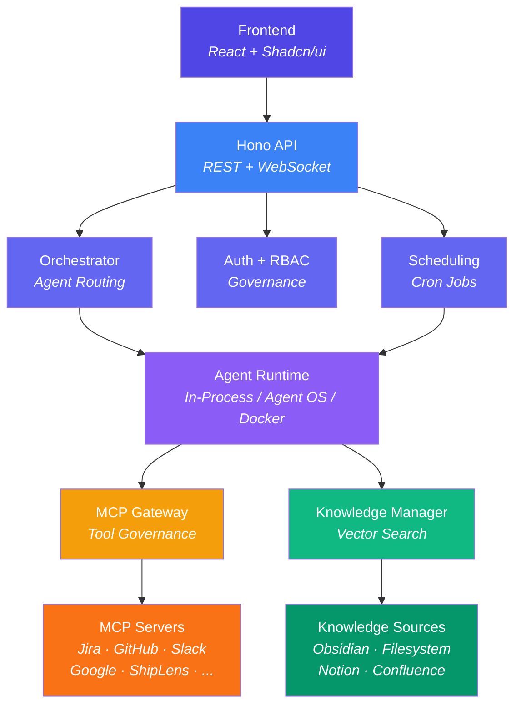

# Tela Wiki

**Tela** is an AI operating system for companies — a platform that connects AI agents to your tools, knowledge, and workflows with enterprise-grade governance.

Built on [Claude Agent SDK](https://docs.anthropic.com/en/docs/agents-sdk) and [Model Context Protocol (MCP)](https://modelcontextprotocol.io/), Tela lets organizations deploy specialized AI agents that can access company tools (Jira, GitHub, Slack, Google Workspace), search internal knowledge bases, run on schedules, and operate within strict role-based access controls.

---

## Wiki Pages

### Core System
| Page | Description |
|------|-------------|
| [Overview & Architecture](./01-overview-and-architecture.md) | System design, principles, tech stack, and high-level architecture |
| [Agent System](./02-agent-system.md) | Agent core, orchestrator, multi-agent coordination, council & batch modes |
| [MCP Governance](./03-mcp-governance.md) | Gateway, policies, tool execution pipeline, permission hardening |

### Data & Knowledge
| Page | Description |
|------|-------------|
| [Knowledge System](./04-knowledge-system.md) | Adapters, vector store, ingestion, semantic search, vault tools |
| [Database & Persistence](./05-database-and-persistence.md) | Schema, migrations, audit log, cost tracking, memory tables |

### Access Control
| Page | Description |
|------|-------------|
| [Auth, RBAC & Governance](./06-auth-rbac-and-governance.md) | Authentication, roles, teams, policies, permission resolution |
| [Security & Safety](./07-security-and-safety.md) | Prompt injection defense, hardening, bypass-immune checks, error resilience |

### Platform
| Page | Description |
|------|-------------|
| [Integrations](./08-integrations.md) | Google, GitHub, Jira, ShipLens, Telegram, Slack connections |
| [Runtime & Execution](./09-runtime-and-execution.md) | Runtime abstraction, streaming, compaction, circuit breakers, cost optimization |
| [Scheduling & Notifications](./10-scheduling-and-notifications.md) | Cron jobs, built-in schedules, notification channels, smart filtering |

### Interface & Operations
| Page | Description |
|------|-------------|
| [Frontend & UI](./11-frontend-and-ui.md) | React app, chat UI, admin panels, setup wizard |
| [Deployment & Operations](./12-deployment-and-operations.md) | Docker, Nix, environment variables, health checks, monitoring |

---

## System Map

---

## Quick Links

- **Getting Started**: See the project [README.md](../README.md) for setup instructions
- **Design Decisions**: See [ARCHITECTURE.md](../ARCHITECTURE.md) for design principles
- **Task History**: See [tasks/](../tasks/) for the full development history
